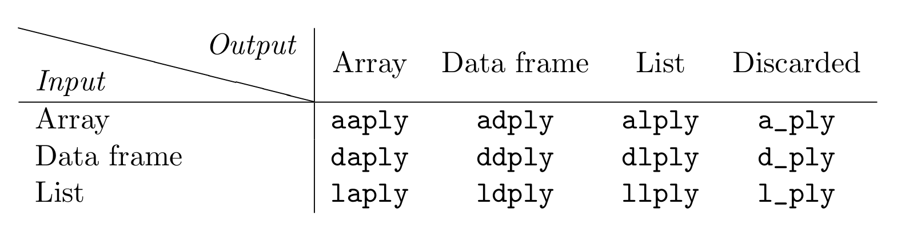

```{r setup, include=FALSE}
knitr::opts_chunk$set(echo = FALSE)

library(microbenchmark)
library(ggplot2)
library(plotly)
source("functions.R")
bench_r_1 <- readRDS("data/bench_r_1.rds")
bench_r_2 <- readRDS("data/bench_r_2.rds")
bench_r_3 <- readRDS("data/bench_r_3.rds")

# Determine 10 most traded BTC pairs
# f <- h5file("data/poloniex.h5", "r")
# sort(sapply(list.groups(f), function(x) f[[sprintf("%s/trades", x)]]$dims[1] ), decreasing = TRUE)[1:10]
```

# Introduction

## Leadership


<!-- Data wrangling, sometimes referred to as data munging, is the process of transforming and mapping data from one "raw" data form into another format with the intent of making it more appropriate and valuable for a variety of downstream purposes such as analytics. Source: Wikipedia -->


## Data Set

- Tick data from Poloniex from 2014-08-14 to 2017-06-18.
- Obtained through REST API, see also https://poloniex.com/support/api.
- Data not necessarily ordered and may need cleaning.

```{r, echo = FALSE, eval = TRUE}
f <- h5file("data/poloniex.h5", "r")
dat <- as.data.frame(f[["BTC_XRP/trades"]][1:10, ])
f$close_all()
dat[, 1] <- as.POSIXct(dat[, 1], origin = "1970-01-01")
colnames(dat) <- c("Date", "Price", "Volume", "GlobalTradeID", "TradeID", "nchunk")
dat
```


## Benchmark Time Series Use Cases

1. Aggregate OHCL 1-minute bars for selected pairs.<br>
<small>Benchmark only based on BTC/XRP as reference.</small>
2. Join aggregated pairs based on Datetime<br>
<small>2.1. Calculate regarding USD Cross rates based on USDT_BTC (not-benchmarked)</small>
3. Filter resulting table (12.12.-31.12.2016)<br>
<small>3.1. Plot results (not-benchmarked)</small>

## Most Liquid Tick Data on Poloniex

```{r, warning=FALSE, fig.align='center', fig.width=12, fig.height=6}
mostliquid <- get_most_liquid()
mostliquid$color <- ifelse(mostliquid$Cross == "BTC-Cross", "blue", "red")
plot_ly(data = mostliquid, 
         x = ~CCY, y = ~TICKS, 
         color = ~Cross,
         type = "bar") %>%
  layout(yaxis = list(title = 'Ticks'), xaxis = list(title = ''))
```

<small>Selected **58.80M** ticks out of **96.29 M** in total.</small>

## Packages Used

- **base**-R (Florian)
- **dplyr** (Rainer)
- **data.table** (Mario)
- **MonetDBLite** (Rainer)
- **RSQLite** memory-mapped (Florian)
- Python **pandas** (Mario, <red>planned</red>) 

# base R

## 1. Calculate USD cross rates on Poloniex

There are several possibilites to obtain the cross rates:

- `tapply()`
- `split()` (followed by `apply()`)
- `match()`

## tapply Intro

```{r, eval = FALSE, echo = TRUE}
function (X, INDEX, FUN = NULL, ..., default = NA, simplify = TRUE) 
```

```{r, echo=TRUE, eval=TRUE}
tapply(1:6, c(1, 1, 1, 2, 2, 3), max)
```

## tapply Use Case

Basic example usage:

```{r, echo = TRUE, eval=FALSE}
data.frame(
    Open = tapply(dat$Price, index, first),
    High = tapply(dat$Price, index, max),
    Low = tapply(dat$Price, index, min),
    Close = tapply(dat$Price, index, tail, 1),
    Volume = tapply(dat$Volume, index, sum)
  )
```

## Split Intro
```{r, echo=TRUE, eval=TRUE}
x <- 1:3
split(x, c(1, 2, 1))
split(x, c(1, 2, 1)) <- split(x, c(1, 1, 2))
x
split(x, c(1, 2, 1)) <- list(0, 9)
x
```

## Split Use Case

`split()` followed by `apply()`:

```{r, echo=TRUE, eval=FALSE}
ui <- !(c(FALSE, tail(index, -1) == head(index, -1)))
i <- cumsum(ui)
dat <- split(dat, i)
data.frame(
    Index  = index[ui],
    Open   = as.double(lapply(dat, function(x) head(x$Price, 1))),
    High   = as.double(lapply(dat, function(x) max(x$Price))),
    Low    = as.double(lapply(dat, function(x) min(x$Price))),
    Close  = as.double(lapply(dat, function(x) tail(x$Price, 1))),
    Volume = as.double(lapply(dat, function(x) sum(x$Volume))) )
```

## match Intro
```{r, echo=TRUE, eval=FALSE}
match(x, table, nomatch = NA_integer_, incomparables = NULL)
```

```{r, echo=TRUE, eval=TRUE}
x <- data.frame(key = LETTERS[1:5], val = rep.int(1, 5))
y <- data.frame(key = c("B", "H", "A"), val = rep.int(1, 3))
match(x$key, y$key)
```

## match Use Case

Basic example usage:

```{r, echo = TRUE, eval=FALSE}
ui <- unique(index)
j <- match(index, ui)
dat <- split(dat, j)

data.frame(
    Index  = ui,
    Open   = as.double(lapply(dat, function(x) head(x$Price, 1))),
    High   = as.double(lapply(dat, function(x) max(x$Price))),
    Low    = as.double(lapply(dat, function(x) min(x$Price))),
    Close  = as.double(lapply(dat, function(x) tail(x$Price, 1))),
    Volume = as.double(lapply(dat, function(x) sum(x$Volume))))
```

## 1. Benchmark results

Unit: **seconds**

```{r, echo=FALSE, warning=FALSE}
knitr::kable(head(summary(bench_r_1), 3), digits = 2)
```

## merge intro

```{r, echo=TRUE, eval=TRUE}
x <- data.frame(A = c(1, 2, 3), B = c(4, 0, 5), C = 7:9)
y <- data.frame(A = c(1, 2, 3), B = c(4, 7, 5), D = 11:13)

merge(x, y) ## natural join on all columns with the same name
merge(x, y, by.x = "A", by.y = "A")
merge(x, y, by.x = c("A", "B"), by.y = c("A", "B"))
```

## merge use case

```{r, eval = FALSE, echo = TRUE}
Reduce(function(...) base::merge(..., by = "Index", all = TRUE), dat.all.df)
```

## 2. Benchmark results

Unit: **seconds**

```{r, echo=FALSE, warning=FALSE}
knitr::kable(head(summary(bench_r_2), 1), digits = 2)
```

## 3. Filter Use Case

```{r, eval=FALSE, echo=TRUE}
base_r_merge[
  base_r_merge$Index > as.POSIXct("2016-12-12") & 
  base_r_merge$Index < as.POSIXct("2016-12-31"), ]
```

```{r, echo=FALSE, warning=FALSE}
knitr::kable(head(summary(bench_r_3), 1), digits = 2)
```

Unit: **milliseconds**

##  Package {data-background="figures/packages_pad.jpg"}

[dplyr:](https://cran.r-project.org/web/packages/dplyr/index.html)
A Grammar of Data Manipulation

A fast, consistent tool for working with data frame like objects,
both in memory and out of memory.

## dplyr (I)

- `dplyr` is the next iteration of `plyr`, focussing on only data frames

12 key functions in `plyr`:
<br/>

[The Split-Apply-Combine Strategy for Data Analysis](https://www.jstatsoft.org/article/view/v040i01/v40i01.pdf) (Wickham 2011, JStatSoft)

## dplyr (II)

- `dplyr` provides a grammar for manipulating tables in R
- most import data manipulation operations are covered
    - selection and manipulation of observation, variables and values
    - summarizing
    - grouping
    - joining
- in-memory processing implemented in C++ (using Rcpp)

## dplyr (III)

- `dplyr` functions work with pipes (`%>%` from package `magrittr`) and
<br/>
- expect tidy data (part of the `tidyverse` package)
</br>

## dplyr (IV)

provides an interface to work with data in

- a `data.frame` or `tibble` (package `tibble`)
- a `data.table` (package `dtplyr`)
- or a database (package `dbplyr`)
    - `dbplyr`: A `dplyr` back end for databases to work with remote database
      tables as if they are in-memory data frames. Basic features works with
      any database that has a `DBI` back end.
    - [list of dplyr backends](https://gist.github.com/piccolbo/3d8ac40291f4eaee644b)

## Related packages

- [spdplyr](https://cran.r-project.org/web/packages/spdplyr/index.html):
  data manipulation verbs for `sp` spatial classes

- [seplyr](https://cran.r-project.org/web/packages/seplyr/index.html):
  standard evaluation improved interfaces for common data manipulation tasks

## Resources

- [RStudio dplyr cheatsheet](https://github.com/rstudio/cheatsheets/raw/master/data-transformation.pdf)
- [dplyr package vignettes](https://cran.r-project.org/web/packages/dplyr/index.html)

    - [Introduction to dplyr](https://cran.r-project.org/web/packages/dplyr/vignettes/dplyr.html)
    - [Programming with dplyr](https://cran.r-project.org/web/packages/dplyr/vignettes/programming.html)
    - [Two-table verbs](https://cran.r-project.org/web/packages/dplyr/vignettes/two-table.html)
    - [Window functions](https://cran.r-project.org/web/packages/dplyr/vignettes/window-functions.html)
    - [dplyr compatibility](https://cran.r-project.org/web/packages/dplyr/vignettes/compatibility.html)

```{r eval=FALSE}
browseVignettes(package = c("dplyr", "tibble"))
```

## 1. Aggregate Use Case dplyr

```{r, echo = TRUE, eval = FALSE}
dat %>% 
    arrange(Date) %>%
    group_by(Index) %>%
    summarise(Open = dplyr::first(Price), 
              High = max(Price), 
              Low = min(Price), 
              Close = dplyr::last(Price), 
              Volume = sum(Volume))
```

## 1. Benchmark Use Case dplyr

Units: **seconds**

```{r, echo = FALSE}
knitr::kable(summary(bench_r_1)[4, ])
```

## 2. Join Use Case dplyr

```{r, echo = TRUE, eval = FALSE}
purrr::reduce(dat.all.df, function(x, y) full_join(x, y, by = "Index"))
```

### Benchmark results

```{r}
knitr::kable(summary(bench_r_2)[2, ])
```

Units: **seconds**

## 3. Filter Use Case dplyr

```{r, echo = TRUE, eval = FALSE}
purrr::reduce(dat.all.df, function(x, y) full_join(x, y, by = "Index"))
```

```{r}
knitr::kable(summary(bench_r_3)[2, ])
```
Unit: **milliseconds**

# data.table

## Introduction

- Created by Matt Dowle, first released in 2008.
- Heavily used package, ~281K downloads on RStudio CRAN mirror last month.
- High performance version of data.frame.

## Introduction (2)
<!--


-->
Video from UseR! 2014: https://www.youtube.com/watch?v=qLrdYhizEMg


## Why is data.table fast?

- Internalize/Optimize common functions (e.g. GForce)
- Efficient sorting functions

## data.table Syntax

```{r, echo=TRUE, eval=FALSE}
library(data.table)
DT[i, j, by]
```

- i: On which rows (WHERE)
- j: What to do (SELECT)
- by: Grouped by what? (GROUP BY)

## 1. Calculate USD cross rates on Poloniex

```{r, eval = FALSE, echo=TRUE}
dat <- data.table(dat) # Convert to data.table
dat[, Index := index]
setkey(dat, Index) # Set index key
setkey(dat, Date) # do the ordering implicitly using key

# Aggregate
dat[, .(Open = data.table::first(Price), 
       High = max(Price), 
       Low = min(Price), 
       Close = data.table::last(Price), 
       Volume = sum(Volume)), by = Index]
```

## 1. Calculate USD cross rates on Poloniex Caveats

- `setkey(dat, Index)` does not bring any performance gains
- In order for GForce to work, do NOT use `first` instead of `data.table::first` (function matching)

```{r, eval = FALSE}
dat[, .(Open = data.table::first(Price), 
          High = max(Price), 
          Low = min(Price), 
          Close = data.table::last(Price), 
          Volume = sum(Volume)), by = Index]
```


## 1. Benchmark results

Unit: **seconds**

```{r, echo=FALSE, warning=FALSE}
knitr::kable(tail(summary(bench_r_1), 3), digits = 2)
```

## 2. Join aggregated pairs based on Datetime

```{r, echo=TRUE, eval = FALSE}
Reduce(function(...) 
  merge(..., by = "Index", all = TRUE), 
  dat.all.hashkey)
```

## 2. Benchmark results

Unit: **seconds**

```{r, echo=FALSE, warning=FALSE}
knitr::kable(tail(summary(bench_r_2), 2), digits = 2)
```

## 2.1 Calculate Cross Rates in USD

```{r, echo = TRUE, eval = FALSE}
dat.outer.join <- Reduce(merge, dat.all.hashkey, by = "Index", all = TRUE)
cols <- !names(dat.outer.join) %in% c("Index", "USDT_BTC")
cols2 <- rep("USDT_BTC", length(which(cols)))
dt <- data.table(dat.outer.join[, "Index"], dat.outer.join[, ..cols] * dat.outer.join[, ..cols2])
```

## 3. Filter resulting table

Filter resulting table from 12.12.-31.12.2016

```{r, echo = TRUE, eval = FALSE}
dt <- zoo::na.locf(dt)
sset <- dt[Index >= as.POSIXct("2016-12-12") & Index <= as.POSIXct("2016-12-31")]
```

Benchmark results: 

```{r}
knitr::kable(tail(summary(bench_r_3), 2))
```

Unit: **milliseconds**

## 3.1 Plot results

```{r, echo = TRUE, eval = FALSE}
cols <- 2:ncol(dt)
tsfilter <- zoo(dt[, ..cols], order.by = dt[, "Index"])
plot(tsfilter)
```

<!-- TODO(florian) 

# SQLite

## Introduction

- Is a embeddable SQL database engine.
- Can be also used in-memory.


```{r, echo = TRUE, eval = FALSE}
oidx <- order(dat$Date)
dat <- dat[oidx, ]
dat$Minutes <- index[oidx]

db <- dbConnect(dbDriver("SQLite"), dbname = ":memory:")
dbWriteTable(db, "tmp", dat)

query <- paste("SELECT Minutes as Ind, MAX(Price) as High,",
               "MIN(Price) as Low, SUM(Volume) as Volume", 
               "FROM tmp GROUP BY Minutes;")
df <- dbGetQuery(db, query)
dbDisconnect(db)
df
```
-->

# Conclusion


## 1. Aggregation Benchmark Summary

```{r, fig.width=12, fig.height=6}
p <- autoplot(bench_r_1)
ggplotly(p)
```

## 1. Aggregation Benchmark Summary

Unit: **seconds**

```{r, echo=FALSE, warning=FALSE}
knitr::kable(summary(bench_r_1), digits = 2)
```


## 2. Merge/Join Benchmark Summary

```{r, fig.width=12, fig.height=6}
p <- autoplot(bench_r_2)
ggplotly(p)
```

## 2. Merge/Join Benchmark Summary

Unit: **seconds**

```{r, echo=FALSE, warning=FALSE}
knitr::kable(summary(bench_r_2), digits = 2)
```

## 3. Filter by Index Date

```{r, fig.width=12, fig.height=6}
p <- autoplot(bench_r_3)
ggplotly(p)
```

## 3. Filter by Index Date

Unit: **milliseconds**

```{r, echo=FALSE, warning=FALSE}
knitr::kable(summary(bench_r_3), digits = 2)
```
## Comparison Table Methods

| Criterion       | base-R | dplyr  | data.table  
|-----------------|--------|--------|------------
| Maintainability |   ++   |   ~    |    ~
| Ease of Use     |   ~    |   +    |    -
| Performance     |   -    |   +    |    ++

